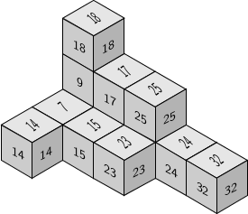
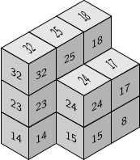

#`numericalsgps` package for `GAP`

##Authors
- **M. Delgado** (Universidade de Porto)

- **P. A. García-Sánchez** (Universidad de Granada)
	
- J. J. Morais (until 2008)
	
##Version 
0.98 dev

##Submited 
2006

##Status
Deposited

***

# Description of the package

Computing with numerical and affine semigroups

##Contents 

- Definition of numerical semigroups and notable elements 
- Presentations of numerical semigroups
- Constructing numerical semigroups from others
- Irreducible numerical semigroups
- Ideals of numerical semigroups
- Numerical semigroups with maximal embedding dimension
- Nonunique factorization invariatns
- Polynomials and numerical semigroups
- Affine semigroups
- Contributed functions

***

#Changes from last summer to current version (i)

- Fixed several small bugs
- Some deprecated functions became synonyms to maintain compatibility 
- Some functions now work on numerical semigroups and ideals
- Now InfoNumSgps is used in more functions
- Added IsUniquelPresentedNumericalSemigroup, IsGenericNumericalSemigroup
- New contributions of Chris O'Neil (see the contribution appendix of the manual) for factorizations, delta sets and $\omega$-primality of numerical semigroups
- Added functions for semigroup of values of curves parametrized by polynomials (also local version; series) 
- Added LFormsOfNumericalSemigroup
- Numerical semigroups with a given set of pseudo-Frobenius numbers

***

#Changes from last summer to current version (ii)

- Added a new chapter for affine semigroups
- Added alternate catenary degrees: monotone, adjacent, equal, homogeneous
- New implementation of $\omega$-primality
- Added special methods for full affine semigroups (speed up factor 1000)
- Interaction with 4ti2gap, 4ti2Interface, NormalizInterface, singular and SingularInterface 
	- Methods implemented depending if these packages have been loaded

***

#Loading the package

```gap
gap> LoadPackage("num");  
#I  Please load package NormalizInterface or 4ti2Interface
#I  to have extended functionalities.
#I  Please load package SingularInterface or singular
#I  (not both) to have extended functionalities.
----------------------------------------------------------------
Loading  NumericalSgps 0.980 dev
For help, type: ?NumericalSgps: 
----------------------------------------------------------------
true
```

```gap
gap> NumSgpsUse         
    NumSgpsUse4ti2
    NumSgpsUse4ti2gap
    NumSgpsUseNormaliz
    NumSgpsUseSingular
    NumSgpsUseSingularInterface
gap> NumSgpsUse4ti2gap();
────────────────────────────────────────────────────────────────────────────────
Loading  4ti2gap 0.0.2 (GAP wraper for 4ti2)
by Pedro A. García-Sánchez (http://www.ugr.es/local/pedro) and
   Alfredo Sánchez-R.-Navarro ().
Homepage: https://bitbucket.org/gap-system/4ti2gap
────────────────────────────────────────────────────────────────────────────────
true
```

***

# Unique and generic minimal presentations

For numerical semigroups

```gap
gap> s:=NumericalSemigroup(3,5,7);
<Numerical semigroup with 3 generators>
gap> IsUniquelyPresentedNumericalSemigroup(s);
true
gap> IsGenericNumericalSemigroup(s);
true
gap> MinimalPresentationOfNumericalSemigroup(s);
[ [ [ 0, 2, 0 ], [ 1, 0, 1 ] ], [ [ 3, 1, 0 ], [ 0, 0, 2 ] ], 
  [ [ 4, 0, 0 ], [ 0, 1, 1 ] ] ]
```

For affine semigroups

```gap
gap> a:=AffineSemigroup([[2,0],[0,2],[1,2],[2,1]]);
<Affine semigroup in 2 dimensional space, with 4 generators>
gap> IsUniquelyPresentedAffineSemigroup(a);
true
gap> IsGenericAffineSemigroup(a);
false
gap> MinimalPresentationOfAffineSemigroup(a);
[ [ [ 2, 0, 1, 0 ], [ 0, 2, 0, 0 ] ], [ [ 1, 0, 2, 0 ], [ 0, 0, 0, 2 ] ] ]
```

# *Dynamic* contributions by Chris O'Neil

Delta sets

```gap
gap> s:=NumericalSemigroup(43,50,72,91);    
<Numerical semigroup with 4 generators>
gap> DeltaSetOfNumericalSemigroup(s);                                     
[ 1 .. 3 ]
```

$\omega$-primality 

```gap
gap> s:=NumericalSemigroup(143,150,172,191);
<Numerical semigroup with 4 generators>
gap> OmegaPrimalityOfNumericalSemigroup(s);time;
11
516
gap> a:=AsAffineSemigroup(s);                   
<Affine semigroup in 1 dimensional space, with 4 generators>
gap> OmegaPrimalityOfAffineSemigroup(a);time;   
11
2111
```
Other timings

4ti2gap | SingularInterface | NormalizInterface
:-----:|:----:| :---:
5520 | 507 | 2111

***

#Another example

Now with $S=\langle 131,301,322,311,401\rangle$

```gap
gap> s:=NumericalSemigroup(131,301,322,311,401);
<Numerical semigroup with 5 generators>
gap> OmegaPrimalityOfNumericalSemigroup(s);time;
19
2519
gap> a:=AsAffineSemigroup(s);
<Affine semigroup in 1 dimensional space, with 5 generators>
gap> OmegaPrimalityOfAffineSemigroup(a);time;
```

4ti2gap | SingularInterface | NormalizInterface
:---:|:---:|:---:
 23554689 | 7196 | 14577957

***

# Semigroups of values and SABGI bases

Given a set of series (actually polynomials) $F$, we can compute an order bases for $K[\![F]\!]$, and the semigroup of values of this ring

```gap
gap> t:=X(Rationals,"t");;                                
gap> l:=[t^5,-t^18-t^21,t^23-t^26];;
gap> SemigroupOfValuesOfCurve_Local(l,"basis");
[ t^5, t^21+t^18, t^26, 1/2*t^42+t^39, t^47 ]
gap> MinimalGeneratingSystem(SemigroupOfValuesOfCurve_Local(l));
[ 5, 18, 26, 39, 47 ]
```
The same can be done for polynomials, and a SAGBI basis

```gap
gap> SemigroupOfValuesOfCurve_Global(l,"basis");
[ t^5, t^21+t^18, t^23 ]
```

These procedures can take advantage of 4ti2\[Gap,Interface\] or Singular\[Interface\]

***

#Lshapes

The factorizations Apéry sets of embedding dimension three numerical semigroups can be arranged in the space as Lshapes that teselate the plane; there are at most two of these 

For embedding dimension four we were able to prove that the number of Lshapes is not bounded

```gap
gap> s:=NumericalSemigroup(7,8,9,13);;
gap> LShapesOfNumericalSemigroup(s);
[ [ [ 0, 0, 0 ], [ 1, 0, 0 ], [ 0, 1, 0 ], [ 0, 0, 1 ], [ 2, 0, 0 ], 
      [ 1, 1, 0 ], [ 0, 2, 0 ], [ 0, 1, 1 ], [ 0, 0, 2 ], [ 1, 2, 0 ], 
      [ 0, 3, 0 ], [ 0, 2, 1 ], [ 0, 4, 0 ] ], 
  [ [ 0, 0, 0 ], [ 1, 0, 0 ], [ 0, 1, 0 ], [ 0, 0, 1 ], [ 2, 0, 0 ], 
      [ 1, 1, 0 ], [ 1, 0, 1 ], [ 0, 1, 1 ], [ 0, 0, 2 ], [ 2, 0, 1 ], 
      [ 1, 1, 1 ], [ 1, 0, 2 ], [ 2, 0, 2 ] ] ]
```

       &nbsp; &nbsp; &nbsp;  

***

#Numerical semigroups with given type

Let $S$ be a numerical semigroup and $h\in \mathbb Z\setminus S$ 

If $h+S\setminus\{0\}\subset S$, then $h$ is a *pseudo-Frobenius* number of $S$

Their cardinality is the Cohen-Macaulay type of $K[\![S]\!]$

```gap
gap> NumericalSemigroupsWithPseudoFrobeniusNumbers([15,19,21]);
[ <Numerical semigroup>, <Numerical semigroup>, <Numerical semigroup>, 
  <Numerical semigroup> ]
gap> List(last,MinimalGeneratingSystem);
[ [ 8, 9, 14, 20 ], [ 9, 11, 13, 14, 16, 17 ], [ 10, 12, 13, 14, 16, 17, 18 ],
  [ 11, 12, 13, 14, 16, 17, 18, 20 ] ]
gap> Length(NumericalSemigroupsWithFrobeniusNumber(21));
1828
```
***

#Affine semigroups

Affine semigroups can be defined in different ways

- by generators
- by equations (some in congruences): *full* affine semigroups
- by inequalities: *normal* affine semigroups

For instance the set of zero-sum sequences of $\mathbb Z_2^2$ can be defined as

```gap
gap> a:=AffineSemigroup("equations",[[[1,0,1],[0,1,1]],[2,2]]);
<Affine semigroup>
gap> GeneratorsOfAffineSemigroup(a);
[ [ 0, 0, 2 ], [ 0, 2, 0 ], [ 2, 0, 0 ], [ 1, 1, 1 ] ]
```

Or the semigroup of points of integer coordinates $(x,y)$ with $2x\ge y$ and $3y\ge x$ as

```gap
gap> a:=AffineSemigroup("inequalities",[[2,-1],[-1,3]]);
<Affine semigroup>
gap> GeneratorsOfAffineSemigroup(a);
[ [ 1, 1 ], [ 1, 2 ], [ 2, 1 ], [ 3, 1 ] ]
```

***

#Conclusion

New research leads to faster algorithms, and the need of faster algorithms also leads to new research

## Sources
- Our research
- Meetings (specially IMNS's)
- zbMATH reviews
- referee reports

***

#Thank you very much for your attention

## and for all the support given and patience to answer our queries/issues
